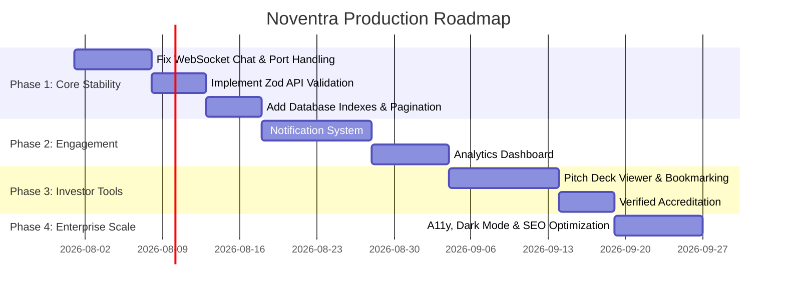

# Noventra Complete Architectural Audit & Technical Documentation

---

# 1. Project Overview

**Noventra** is a next-generation, multi-role digital ecosystem platform designed to connect startup founders, venture capital/angel investors, and skilled talent (engineers, designers, co-founders, interns). It serves as a unified hub for launching, funding, recruiting for, and growing early-stage ventures.

### Vision
To democratize startup creation and investment by eliminating friction between founders seeking capital/talent and investors seeking high-conviction deal flow. Noventra bridges social networking, startup management, direct investor pitching, and real-time WebRTC video meeting rooms in a single integrated web application.

### Target Users
1. **Founders (`FOUNDER`)**: Entrepreneurs building early-stage companies who need to showcase their product, hire team members, pitch VCs, and manage incoming interest.
2. **Investors / VCs (`INVESTOR`)**: Angel investors, VC firm partners, and syndicate leads looking to discover vetted early-stage startups, track portfolio metrics, and connect directly with founders.
3. **Talent / Users (`USER`)**: Software engineers, designers, product managers, and students seeking co-founder roles, full-time positions, or internships at high-growth startups.

### Business Model
Noventra operates as a B2B/B2C SaaS platform:
- **Free Tier**: Startup registration, public feed participation, basic directory search.
- **Premium Founder Tier**: Advanced pitch analytics, featured startup directory placement, priority VC introduction slots.
- **Investor Suite**: Premium deal-flow filtering, direct video room scheduling, syndication management.
- **Enterprise / Accelerator Tier**: Private incubators, cohort management, white-labeled startup pitch days.

### Main Purpose
To provide an end-to-end operational operating system for startup building—moving from initial idea registration and team assembly to active VC pitching, direct messaging, and real-time video pitch meetings.

---

# 2. Tech Stack

### Frontend
- **Framework**: Next.js `16.2.7` (App Router, Turbopack enabled)
- **Language**: TypeScript `^5`
- **Styling**: Vanilla CSS (`src/app/globals.css`), Tailwind CSS `^4`, `@tailwindcss/postcss`, `tw-animate-css`
- **UI Components**: Custom primitives using `@base-ui/react` `^1.5.0`, `shadcn` `^4.10.0`, `class-variance-authority`, `clsx`, `tailwind-merge`
- **Iconography**: `lucide-react` `^1.17.0`
- **Animations**: CSS transitions, keyframe animations via `tw-animate-css`
- **State Management**: React Context (`FeedContext.tsx`), local component state (`useState`, `useRef`), `socket.io-client` event listeners
- **Routing**: Next.js App Router file-system based routing (`src/app`)
- **Data Fetching**: Native `fetch` API wrapped in custom diagnostic helper (`src/lib/apiConfig.ts`), custom WebRTC hook (`src/hooks/useWebRTC.ts`)
- **Build Tools**: Next.js Turbopack compiler, PostCSS `postcss.config.mjs`

### Backend
- **Framework**: Express.js `^5.2.1`
- **Runtime / Language**: Node.js with TypeScript (`ts-node` `^10.9.2`, `typescript` `^6.0.3`)
- **ORM**: Prisma ORM `^6.2.1` (`@prisma/client`)
- **Authentication**: Clerk Node SDK (`@clerk/clerk-sdk-node` `^4.13.23`) with `ClerkExpressRequireAuth` route middleware
- **File Uploads**: Multer `^2.1.1` + Cloudinary (`cloudinary` `^2.10.0`, `multer-storage-cloudinary` `^4.0.0`)
- **Real-Time Communication**: Socket.IO `^4.8.3` integrated with Node `http.Server`
- **APIs**: RESTful JSON HTTP endpoints
- **Validation**: Handled via route-level condition checks (Zod schema layer recommended)
- **Middleware**: `cors`, `express.json()`, `ClerkExpressRequireAuth()`, custom error handling

### Database
- **Engine**: PostgreSQL (managed via Prisma connection pooling)
- **Schema Overview**: 10 relational models (`User`, `Startup`, `Request`, `TeamMember`, `ConnectedVC`, `Meeting`, `Post`, `Like`, `Comment`, `Bookmark`, `Follow`, `Message`) and 5 core enums (`Role`, `RequestType`, `RequestStatus`, `TeamRole`, `MeetingStatus`).
- **Relationships**: 1-to-many (Founder to Startups, User to Posts), many-to-many junction tables (`Follow`, `Like`, `Bookmark`, `ConnectedVC`, `TeamMember`).

### Infrastructure & Services
- **Deployment Platform**: Node.js backend on Port `5000` / Next.js client on Port `3000`/`3001`
- **Environment Variables**: Managed via `.env` (server) and `.env.local` (client)
- **Media Storage**: Cloudinary Cloud Storage (subfolders: `noventra/images`, `noventra/documents`, `noventra/misc`)
- **Third-Party Services**:
  - **Clerk Auth**: User authentication, JWT issuance, public metadata role synchronization
  - **Groq AI SDK**: Artificial Intelligence generation using `llama3-8b-8192` model
  - **Google STUN**: WebRTC NAT traversal ICE servers (`stun:stun.l.google.com:19302`)

---

# 3. Folder Structure

```
Noventra/
├── client/                      # Next.js Frontend Application
│   ├── public/                  # Static assets & icons
│   ├── src/
│   │   ├── app/                 # Next.js App Router Pages & Subroutes
│   │   │   ├── auth/            # Sign-In & Sign-Up authentication pages
│   │   │   ├── dashboard/       # Role-specific dashboards (founder, vc, user)
│   │   │   ├── discover/        # Startup discovery subpage
│   │   │   ├── feed/            # Social feed page & post creation
│   │   │   ├── inbox/           # Request mailbox (incoming/outgoing applications)
│   │   │   ├── investors/       # VC & Angel Investor directory
│   │   │   ├── meeting/         # WebRTC pitch video meeting rooms
│   │   │   ├── messages/        # Direct messaging chat interface
│   │   │   ├── onboarding/      # Initial user role selection form
│   │   │   ├── profile/         # User profile pages ([id])
│   │   │   ├── settings/        # User settings page
│   │   │   ├── startups/        # Startup directory & detailed view ([startupId])
│   │   │   ├── globals.css      # Core CSS tokens & Tailwind setup
│   │   │   ├── layout.tsx       # Root App Layout with Clerk & Feed providers
│   │   │   └── page.tsx         # Public landing page
│   │   ├── components/          # Reusable UI & Feature components
│   │   │   ├── meetings/        # ControlsBar, Lobby, MeetingRoom, ParticipantList
│   │   │   ├── ui/              # UI primitives (button.tsx)
│   │   │   └── Navbar.tsx       # Global sticky navigation bar with unread badges
│   │   ├── context/             # React Context Providers
│   │   │   └── FeedContext.tsx  # Global feed state, optimistic updates, SWR revalidation
│   │   ├── hooks/               # Custom React Hooks
│   │   │   └── useWebRTC.ts     # Signaling, RTCPeerConnection, audio/video/screen management
│   │   ├── lib/                 # Shared Utilities & API Config
│   │   │   ├── api.ts           # Axios client helper
│   │   │   ├── apiConfig.ts     # Centralized fetch wrapper & URL resolver
│   │   │   ├── feedStore.ts     # Feed store helpers
│   │   │   └── utils.ts         # Tailwind class merger (`cn`)
│   │   └── middleware.ts        # Clerk route protection & redirect rules
│   └── package.json
│
└── server/                      # Express.js Backend Server
    ├── prisma/                  # Database configuration
    │   ├── schema.prisma        # PostgreSQL models, enums & relations
    │   └── seed.ts              # Comprehensive database seeding script
    ├── routes/                  # REST API Route Handlers
    │   ├── ai.ts                # Groq AI generation endpoints
    │   ├── meetings.ts          # Meeting creation & verification endpoints
    │   ├── messages.ts          # Direct messaging & conversation endpoints
    │   ├── posts.ts             # Social posts, likes, comments & bookmarks
    │   ├── requests.ts          # Connection, job & investment requests
    │   ├── startups.ts          # Startup registration, discovery & details
    │   ├── upload.ts            # Cloudinary file upload endpoint
    │   └── users.ts             # User sync, role updates, profiles & follows
    ├── socket/                  # Real-Time WebSockets
    │   └── meetingHandler.ts    # Meeting signaling, waiting room & peer management
    ├── index.ts                 # Express server bootstrap & Socket.IO mounting
    └── package.json
```

### Folder Responsibilities:
- **`src/app/`**: Contains page endpoints and layouts mapped to URL routes. Implements page UI rendering and data fetching hooks.
- **`src/components/`**: House modular, reusable UI components. Keeps page files clean and separates layout logic from standalone components like `Navbar` and WebRTC room widgets.
- **`src/lib/`**: Centralized configuration utilities, such as `apiConfig.ts`, which guarantees API URL sanitization, logging, and headers across every request.
- **`src/hooks/`**: Handles complex client-side side-effects. `useWebRTC.ts` encapsulates peer connection setup, track swaps, and signaling socket listeners.
- **`src/context/`**: Manages application-wide React state, specifically `FeedContext.tsx` for caching posts and enabling instant optimistic feedback for likes and comments.
- **`server/routes/`**: Handles incoming HTTP endpoints, enforces `ClerkExpressRequireAuth` guards, executes Prisma queries, and returns JSON payloads.
- **`server/socket/`**: Houses Socket.IO event listeners, managing room participant state maps and WebRTC signaling exchange (`send-signal`, `toggle-media`).

---

# 4. Routing

| Route URL | Purpose | Key Components | Data Fetched | Auth Required? | API Calls Made |
| :--- | :--- | :--- | :--- | :--- | :--- |
| `/` | Public Hero & Landing Page | `Button`, `SignInButton`, `SignUpButton`, Lucide icons | Clerk Auth state | Public | None |
| `/auth/login` | Sign In Page | Clerk `<SignIn />` widget | Clerk session | Public | Clerk Auth |
| `/auth/signup` | Sign Up Page | Clerk `<SignUp />` widget | Clerk session | Public | Clerk Auth |
| `/onboarding` | Role Selection | `OnboardingForm`, `Button` | User role selection | Authenticated | `POST /api/users/role`, `POST /api/users/sync` |
| `/feed` | Main Community Social Feed | `Navbar`, `FeedProvider`, `Button` | Feed posts, comments, likes, DB user | Authenticated | `GET /api/posts`, `POST /api/posts`, `POST /api/posts/:id/like`, `POST /api/posts/:id/comment` |
| `/startups` | Startup Directory & Filters | `Navbar`, `Button`, Filter Inputs | All registered startups | Public / Actions Auth | `GET /api/startups`, `POST /api/startups/:id/requests` |
| `/startups/[startupId]` | Startup Detailed Overview | `Navbar`, `Button`, Request Modal | Startup details, team, connected VCs | Public / Actions Auth | `GET /api/startups/:id`, `GET /api/users/clerk/:clerkId`, `POST /api/startups/:id/requests` |
| `/investors` | Investor Directory | `Navbar`, `Button`, Filter Inputs | Active investors open to invest | Protected (`FOUNDER`/`INVESTOR`) | `GET /api/users/investors`, `POST /api/users/:id/follow` |
| `/inbox` | Connection Requests Mailbox | `Navbar`, `Button` | Incoming requests (Founders) & sent requests | Authenticated | `GET /api/users/clerk/:clerkId`, `GET /api/requests/incoming`, `GET /api/requests/sent`, `PATCH /api/requests/:id/status` |
| `/messages` | Direct Messaging Interface | `Navbar`, `Button`, Chat Viewport | Mutual follow conversations & message history | Authenticated | `GET /api/messages/conversations`, `GET /api/messages/:otherUserId`, `POST /api/messages` |
| `/profile/[id]` | User Profile & Portfolio | `Navbar`, `Button`, Edit Profile Modal | User details, posts, startups, follow flags | Authenticated | `GET /api/users/clerk/:clerkId`, `GET /api/users/profile/:id`, `POST /api/users/:id/follow`, `PUT /api/users/profile` |
| `/dashboard` | Server-side Role Redirector | Loader | User DB role | Authenticated | `GET /api/users/clerk/:userId` |
| `/dashboard/founder` | Founder Operations Console | `Navbar`, `Button` | Founder's startups, pending counts, active meetings | Protected (`FOUNDER`) | `GET /api/startups/me`, `GET /api/meetings/:startupId`, `POST /api/meetings` |
| `/dashboard/founder/startup/new` | Register Startup Form | `Button`, Input fields | Form submission | Protected (`FOUNDER`) | `POST /api/startups` |
| `/dashboard/founder/startup/[id]` | Founder Management Portal | `Button`, Team & VC Rosters | Founder's specific startup data | Protected (`FOUNDER`) | `GET /api/startups/me`, `POST /api/meetings` |
| `/dashboard/user` | Talent Applications Console | `Navbar`, `Button` | Sent job/internship requests, joined teams | Protected (`USER`) | `GET /api/users/clerk/:clerkId`, `GET /api/requests/sent` |
| `/dashboard/vc` | Investor Dealflow Console | `Navbar`, `Button`, Toggle Switch | Sent allocation pitches, connected startups | Protected (`INVESTOR`) | `GET /api/users/clerk/:clerkId`, `GET /api/requests/sent`, `PUT /api/users/profile` |
| `/meeting/[id]` | WebRTC Video Pitch Room | `Lobby`, `MeetingRoom`, `ControlsBar`, `ParticipantList` | Meeting info, user details, signaling streams | Public / Host Auth | `GET /api/meetings/code/:code`, `GET /api/users/clerk/:clerkId`, Socket.IO events |
| `/settings` | Account Settings | `Navbar` | Placeholder settings info | Authenticated | Clerk Auth |

---

# 5. Authentication

Noventra uses **Clerk Authentication** coupled with a PostgreSQL synchronization layer.

```
[User Signs Up / Logs In via Clerk]
       │
       ▼
[Next.js Client Middleware (`src/middleware.ts`)]
       │ (Validates session token for non-public routes)
       ▼
[Call `/api/users/sync` or `/api/users/role`]
       │
       ▼
[Server Upserts `User` Record in PostgreSQL DB & Updates Clerk Public Metadata]
```

### Authentication Flow Details:
1. **Signup / Login**: Handled via Clerk SDK on `/auth/login` and `/auth/signup`.
2. **Session Handling**: Clerk handles JWT tokens stored in cookies/headers. On backend requests, `ClerkExpressRequireAuth({})` verifies the bearer token.
3. **Protected Routes**: Governed by `src/middleware.ts`. Unauthenticated requests to private routes are redirected to `/auth/login`.
4. **Role Handling**: Supported roles are `FOUNDER`, `INVESTOR`, and `USER`. During onboarding (`/onboarding`), users select a role which triggers:
   - `POST /api/users/role`: Updates `user.role` in PostgreSQL and updates Clerk `publicMetadata.role`.
   - `user.reload()` on client to refresh Clerk claims.
5. **Database Synchronization**:
   - `POST /api/users/sync`: Ensures that whenever a user logs in, their `clerkId`, `email`, and `name` are synced to the PostgreSQL `User` table via `prisma.user.upsert`.

---

# 6. Database

Defined in `server/prisma/schema.prisma`:

### Models Overview

#### 1. `User`
- **Purpose**: Core profile table for founders, investors, and talent.
- **Columns**: `id` (UUID), `clerkId` (Unique String), `email` (Unique String), `name` (String), `role` (Enum `Role`), `avatarUrl`, `bio`, `skills` (String[]), `interests` (String[]), `location`, `openToInvest` (Boolean), `ticketSize`, `investmentInterests` (String[]), `portfolioCount` (Int), `createdAt`, `updatedAt`.
- **Relations**: Startups owned (`FounderStartups`), Sent Requests, Received Requests, Team Memberships, Posts, Likes, Comments, Bookmarks, Followers, Following, Sent Messages, Received Messages.
- **Used By**: Profile pages, Navbar, Inbox, Dashboards, Direct Messaging.

#### 2. `Startup`
- **Purpose**: Represents registered companies/ideas.
- **Columns**: `id` (UUID), `name`, `logo`, `description`, `industry`, `stage`, `location`, `requiredRoles` (String[]), `fundingNeeded`, `tagline`, `teamSize`, `founderId` (Foreign Key -> User), `createdAt`, `updatedAt`.
- **Relations**: Founder (`User`), Requests, TeamMembers, ConnectedVCs, Meetings, Posts.
- **Used By**: Startup Directory, Founder Dashboard, Startup Detail Page, Meeting Rooms.

#### 3. `Request`
- **Purpose**: Tracks application requests for jobs, internships, co-founder roles, or investment allocations.
- **Columns**: `id` (UUID), `senderId` (FK -> User), `receiverFounderId` (FK -> User), `startupId` (FK -> Startup), `requestType` (Enum `JOB`, `INTERN`, `CO_FOUNDER`, `INVESTMENT`), `message`, `status` (Enum `PENDING`, `ACCEPTED`, `REJECTED`), `createdAt`, `updatedAt`.
- **Used By**: Inbox Mailbox, Founder Dashboard, User Dashboard, VC Dashboard.

#### 4. `TeamMember`
- **Purpose**: Junction table connecting accepted Users to Startups as team members.
- **Columns**: `id` (UUID), `startupId` (FK -> Startup), `userId` (FK -> User), `role` (Enum `EMPLOYEE`, `INTERN`, `CO_FOUNDER`), `status` (Default `"ACTIVE"`), `joinedAt`.
- **Used By**: Startup Detail Page, Startup Management Portal, User Dashboard.

#### 5. `ConnectedVC`
- **Purpose**: Junction table linking accepted Investor Users to Startups.
- **Columns**: `id` (UUID), `startupId` (FK -> Startup), `vcId` (String -> User ID), `connectedAt`.
- **Used By**: Startup Detail Page, Founder Portal, VC Dashboard.

#### 6. `Meeting`
- **Purpose**: Real-time WebRTC video room session record.
- **Columns**: `id` (UUID), `startupId` (FK -> Startup), `hostFounderId` (String), `meetingCode` (Unique String), `status` (Enum `ACTIVE`, `ENDED`), `createdAt`.
- **Used By**: Founder Dashboard, Pitch Video Meeting Room (`/meeting/[id]`).

#### 7. `Post`
- **Purpose**: Community feed posts.
- **Columns**: `id` (UUID), `content`, `postType` (String: `"text"`, `"image"`, `"startup_update"`, `"hiring"`, `"funding"`), `mediaUrl`, `startupId` (Optional FK -> Startup), `authorId` (FK -> User), `createdAt`, `updatedAt`.
- **Used By**: Main Feed (`/feed`), User Profiles.

#### 8. `Like`, `Comment`, `Bookmark`
- **Purpose**: Social interactions linked to `Post` and `User`.
- **Unique Constraints**: `Like` (`[userId, postId]`), `Bookmark` (`[userId, postId]`).

#### 9. `Follow`
- **Purpose**: Self-referential User follower/following relationship.
- **Primary Key**: Composite `@@id([followerId, followingId])`.

#### 10. `Message`
- **Purpose**: Direct messages between mutual followers.
- **Columns**: `id` (UUID), `senderId` (FK -> User), `receiverId` (FK -> User), `content`, `createdAt`.
- **Used By**: Direct Messages (`/messages`).

---

# 7. APIs

All API endpoints are mounted on `/api/...` in Express:

### User Endpoints (`/api/users`)
- `POST /api/users/sync`: Upserts user from Clerk data. Body: `{ clerkId, email, name, role }`.
- `POST /api/users/role` (Auth): Updates user role in DB and Clerk metadata. Body: `{ role }`.
- `GET /api/users/clerk/:clerkId`: Fetches DB user by Clerk ID.
- `GET /api/users/investors` (Auth): Returns all investors where `openToInvest: true`.
- `PUT /api/users/profile` (Auth): Updates user bio, skills, interests, ticketSize, openToInvest, etc.
- `GET /api/users/profile/:id` (Auth): Returns profile details, posts, startups, follower counts, and `isMutual` follow state.
- `POST /api/users/:id/follow` (Auth): Toggles follow/unfollow for target user.

### Startup Endpoints (`/api/startups`)
- `GET /api/startups`: Returns all startups with founder details.
- `GET /api/startups/me` (Auth): Returns startups owned by the authenticated founder with team members and pending requests.
- `POST /api/startups` (Auth): Creates a new startup (Founder role enforced).
- `GET /api/startups/:id`: Returns single startup details, founder, team members, and connected investors.
- `POST /api/startups/:startupId/requests` (Auth): Submits a job, internship, co-founder, or investment request to a startup.

### Request Endpoints (`/api/requests`)
- `POST /api/requests` (Auth): Creates a connection request.
- `GET /api/requests/sent` (Auth): Fetches requests sent by the current user.
- `GET /api/requests/incoming` (Auth): Fetches incoming requests for the founder's startups.
- `PUT /api/requests/:id` (Auth): Updates request status (`ACCEPTED`/`REJECTED`) and auto-creates `TeamMember` or `ConnectedVC`.
- `PATCH /api/requests/:id/status` (Auth): Alternative route for founder status update.

### Post Endpoints (`/api/posts`)
- `POST /api/posts` (Auth): Creates a new feed post.
- `GET /api/posts`: Returns feed posts with optional `isLiked` and `isBookmarked` flags based on auth header.
- `POST /api/posts/:id/like` (Auth): Toggles like on a post.
- `POST /api/posts/:id/bookmark` (Auth): Toggles bookmark on a post.
- `POST /api/posts/:id/comment` (Auth): Adds a comment to a post.
- `GET /api/posts/:id/comments` (Auth): Fetches comments for a post.

### Messaging Endpoints (`/api/messages`)
- `GET /api/messages/conversations` (Auth): Lists mutual follow users and their last message.
- `GET /api/messages/:otherUserId` (Auth): Fetches message history with a mutual follower.
- `POST /api/messages` (Auth): Sends a message (Mutual follow enforced).

### Meeting Endpoints (`/api/meetings`)
- `POST /api/meetings` (Auth): Creates an active meeting room with a unique code (Founder enforced).
- `GET /api/meetings/:startupId` (Auth): Fetches active meetings for a startup.
- `GET /api/meetings/code/:meetingCode`: Public endpoint fetching meeting details by code.

### AI & Upload Endpoints
- `POST /api/ai/generate` (Auth): Uses Groq API (`llama3-8b-8192`) to generate startup elevator pitches, cold emails, or profile improvement tips.
- `POST /api/upload` (Auth): Accepts single file via Multer and uploads to Cloudinary, returning image/document URL.

---

# 8. Features

1. **Role-Based Onboarding & Dashboards**: Dedicated UI views and capabilities tailored for Founders, Investors, and Talent.
2. **Community Social Feed**: Post creation (text, image, startup update), liking, commenting, and optimistic state updates.
3. **Startup Directory & Detail Pages**: Multi-filter startup search (by stage, industry, hiring status, funding needed) and dedicated pitch profiles.
4. **Investor Directory & Dealflow Toggle**: List of active VCs with ticket size filters and an instant "Open to Invest" availability toggle.
5. **Request Mailbox & Team Roster Integration**: Founders review incoming applications; accepting automatically adds talent to the startup's team roster or VCs to connected investors.
6. **WebRTC Video Pitch Rooms**: Custom video conferencing system supporting up to 6 participants, host waiting room admission/rejection, camera/mic toggles, and screen sharing.
7. **Direct Messaging**: 1-on-1 private messaging restricted to mutual followers to prevent spam.
8. **Groq AI Pitch Assistant**: AI generation tool assisting founders in drafting elevator pitches and investor cold emails.
9. **Cloudinary Asset Storage**: Cloud media hosting for avatars, logos, and post attachments.

---

# 9. User Roles

| Permission / Capability | `FOUNDER` | `INVESTOR` | `USER` (Talent) | `ADMIN` |
| :--- | :--- | :--- | :--- | :--- |
| Register Startup Profiles | Yes | No | No | N/A (Not Implemented) |
| Start WebRTC Pitch Meetings | Yes | No (Participant only) | No (Participant only) | N/A |
| Review Incoming Mailbox Requests | Yes | No | No | N/A |
| Access Investor Directory | Yes | Yes | No (Redirected) | N/A |
| Submit Investment Allocations | No | Yes | No | N/A |
| Apply for Jobs / Internships | No | No | Yes | N/A |
| Direct Messaging | Mutual Follows | Mutual Follows | Mutual Follows | N/A |

---

# 10. Feed Workflow

```
[User Submits Post Form] ──> [Optimistic Local State Update] ──> [POST /api/posts]
                                                                        │
                                                                        ▼
                                                              [Save to PostgreSQL]
                                                                        │
                                                                        ▼
                                                              [Return Post Object]
```

- **Fetching**: Handled via `FeedContext.tsx` using a Stale-While-Revalidate (SWR) pattern. Initial load fetches `GET /api/posts` with `Authorization: Bearer <token>`.
- **Likes & Bookmarks**: Optimistic updates flip `isLiked` / `isBookmarked` immediately, updating count counters before background HTTP requests complete.
- **Current Problems**: Feed lacks server-side pagination (fetches all posts at once), infinite scrolling is not implemented, and media uploads are limited to raw URL strings in post creation UI.

---

# 11. Messaging Workflow

- **Guard**: Messaging is restricted to **Mutual Followers** (`checkMutualFollow` helper in `server/routes/messages.ts`).
- **Conversations List**: `GET /api/messages/conversations` filters followers and following lists to derive mutual IDs, then retrieves the latest message for each connection.
- **Real-Time Delivery**: Currently operates via **HTTP Polling** (client polls `GET /api/messages/:otherUserId` every 4 seconds when a chat is open).
- **Current Limitations**: Messages are not pushed via WebSockets in real time; there are no unread message indicators or typing status indicators.

---

# 12. Startup Directory

- **Creation**: Founders navigate to `/dashboard/founder/startup/new`, providing name, description, industry, stage, location, required roles, and funding needed. `POST /api/startups` creates the startup record.
- **Ownership**: The creating user's `id` is stored as `founderId`. Only `founderId` matches can edit startup details or host meeting rooms.
- **Discovery**: `/startups` provides real-time client-side filtering across text queries, industry, stage, hiring status, and funding needs.

---

# 13. UI Components

- **`Navbar.tsx`**: Sticky top bar. Dynamic nav links based on role (`FOUNDER`/`INVESTOR` see "Investors" link). Displays pending inbox badge counts via `inbox-updated` window events. Includes mobile responsive drawer and avatar dropdown.
- **`Button.tsx`**: Custom button primitive built on `@base-ui/react` supporting variants (`default`, `outline`, `secondary`, `destructive`).
- **`Lobby.tsx`**: Pre-meeting room interface. Previews local camera/mic stream, handles guest name input, and renders waiting room status.
- **`MeetingRoom.tsx`**: WebRTC video grid layout. Renders local video stream and remote participant video cards dynamically.
- **`ControlsBar.tsx`**: Floating bottom bar in pitch rooms providing audio, video, screen share, participant list toggle, and leave call controls.
- **`ParticipantList.tsx`**: Slide-over panel for meeting hosts to admit or reject waiting room participants.

---

# 14. State Management

- **Global Context (`FeedContext.tsx`)**:
  - Exposes `posts`, `dbUser`, `loading`, `isRefreshing`, `error`.
  - Provides helper methods: `loadFeed`, `toggleLikeOptimistic`, `toggleBookmarkOptimistic`, `addPostOptimistic`, `incrementCommentCount`.
- **WebRTC Hook (`useWebRTC.ts`)**:
  - Manages `localStream`, `remoteStreams`, `admittedUsers`, `waitingUsers`, `peersRef` (`Map<socketId, RTCPeerConnection>`), and signaling socket listeners.
- **Problems**: Dual state tracking between Clerk user and database user sometimes requires manual re-fetching; absence of global state store (like Zustand or Redux) leads to prop drilling in deep pages.

---

# 15. System Safety & Access Controls

- **Authentication Guard**: Express routes leverage `ClerkExpressRequireAuth({})` to verify incoming JWT bearer tokens.
- **Ownership Verification**: Route handlers verify resource ownership (e.g., checking `startup.founderId === user.id` in `meetings.ts` and `requests.ts`).
- **Secret Management**: API keys (`CLERK_SECRET_KEY`, `DATABASE_URL`, `CLOUDINARY_URL`, `GROQ_API_KEY`) are managed strictly on the backend via environment variables.
- **Access Control Gaps**:
  - Lack of a centralized request validation schema (e.g., Zod) leaves endpoints vulnerable to malformed JSON payloads.
  - CORS configuration allows any localhost port in development mode (`/^http:\/\/(localhost|127\.0\.0\.1):\d+$/`).

---

# 16. Performance

- **Unnecessary Renders**: `Navbar` refetches DB user information on multiple route changes and window events without memoizing the result.
- **Polling Overhead**: Direct messaging relies on 4-second interval HTTP polling rather than WebSocket push notifications.
- **Missing Pagination**: `GET /api/posts` and `GET /api/startups` query the database without `take` or `skip` parameters, returning the entire database dataset.
- **Database Indexing**: Prisma schema lacks explicitly defined indexes on high-frequency foreign key lookup fields like `authorId`, `senderId`, `receiverId`, and `startupId`.

---

# 17. Current Problems

### Critical
1. **Port Conflict on Launch**: Port `5000` conflict causes backend crashes if an orphaned server process remains running (`EADDRINUSE`).
2. **Missing Real-Time WebSockets for Chat**: Direct messaging uses HTTP polling instead of Socket.IO events, introducing latency and server strain.

### High
1. **Lack of DB Indexes**: Foreign keys (`authorId`, `founderId`, `senderId`, `receiverId`) lack Prisma `@@index` annotations, which will degrade database performance as tables grow.
2. **No API Validation Layer**: Request bodies are parsed manually without schema validation libraries (such as Zod).
3. **Missing Pagination**: Feed posts, startup directories, and messages lack pagination.

### Medium
1. **Role Terminology Inconsistency**: Frontend uses `"vc"` and `"talent"`, whereas database enums use `"INVESTOR"` and `"USER"`, requiring manual string mapping throughout code.
2. **Un-memoized Context Callbacks**: Some Context functions trigger unnecessary re-renders across consumers.

### Low
1. **Deprecated Next.js Middleware Warning**: `middleware.ts` triggers a deprecation warning in Next.js 16.2.7.
2. **Placeholder Settings Page**: `/settings` contains static text without active account management options.

---

# 18. Missing Features

To reach production readiness, Noventra requires the following enhancements:

- **Notifications**: Centralized notification center for new requests, post likes, comments, and meeting invites.
- **WebSockets for Direct Messaging**: Replacing HTTP polling with real-time Socket.IO chat events.
- **Feed Pagination & Infinite Scroll**: Implementing cursor-based pagination for social feed posts.
- **Global Search & Filter**: Unified search bar across posts, startups, founders, and investors.
- **Trending Startups & Analytics**: Founder dashboard analytics tracking pitch deck views and profile impressions.
- **Saved Posts View**: Page allowing users to browse their bookmarked posts.
- **Verification Badges**: Admin-verified badges for accredited VCs and registered entities.
- **Dark Mode Toggle**: Theme switching options.
- **Accessibility (a11y)**: ARIA labels and keyboard navigation improvements across WebRTC meeting controls.

---

# 19. Development Roadmap



### Phase 1: Core Stabilization & Security (Effort: 2.5 Weeks)
- Migrate Direct Messaging to Socket.IO real-time events.
- Add Zod validation middleware to Express routes.
- Add Prisma database indexes (`@@index`) and implement cursor pagination on `/api/posts` and `/api/startups`.

### Phase 2: User Engagement & Notifications (Effort: 2 Weeks)
- Build a real-time notification engine for incoming applications, likes, and messages.
- Add founder analytics for profile views and meeting metrics.

### Phase 3: Advanced Investor & Founder Suite (Effort: 2 Weeks)
- Implement an in-app PDF pitch deck viewer with Cloudinary integration.
- Add VC accreditation verification workflows.

### Phase 4: Polish & Scale (Effort: 1.5 Weeks)
- Add dark/light mode theme toggle.
- Improve WebRTC accessibility (ARIA controls, keyboard shortcuts).
- Implement full SEO meta tags and open-graph card generation.

---

# 20. Code Quality Review

- **Architecture**: **8/10** — Clean separation between Next.js frontend and Express backend. WebRTC signaling and Prisma integration are well isolated.
- **Naming Conventions**: **7/10** — Minor inconsistencies exist between frontend role strings (`"vc"`, `"talent"`) and backend enums (`"INVESTOR"`, `"USER"`).
- **Folder Structure**: **8.5/10** — Logical organization under `src/app`, `src/components`, `src/context`, and Express `routes/`.
- **Component Quality**: **7.5/10** — Components are functional and visual, though large pages like `/feed/page.tsx` and `/meeting/[id]/page.tsx` could be refactored into smaller sub-components.
- **Type Safety**: **7/10** — TypeScript is used throughout, but many pages define interfaces inline rather than sharing a global `@/types` module.
- **Reusability**: **8/10** — Utility helpers like `apiConfig.ts` provide reusable API fetch wrappers.

---

# 21. Overall Project Health

| Category | Score (out of 10) | Evaluation Rationale |
| :--- | :---: | :--- |
| **Architecture** | **8.0** | Robust split between App Router frontend, Express backend, and Socket.IO WebRTC signaling. |
| **UI Design** | **8.5** | Modern aesthetics using Tailwind, clean cards, role badges, and responsive layouts. |
| **User Experience (UX)** | **8.0** | Smooth onboarding, clear role division, interactive WebRTC meeting rooms with waiting rooms. |
| **Backend Robustness** | **7.5** | Effective Express routes with Clerk auth middleware, though lacking schema validation layers. |
| **Database Design** | **8.0** | Comprehensive Prisma relational models covering users, startups, requests, posts, and messaging. |
| **System Safety** | **7.0** | Authenticates via Clerk JWTs and verifies resource ownership, but lacks Zod input validation and rate limiting. |
| **Performance** | **7.0** | Functional for MVP, but lacks DB indexes, pagination, and relies on chat polling. |
| **Scalability** | **7.5** | PostgreSQL and Cloudinary support scale well; chat requires WebSocket refactoring for scale. |
| **Code Quality** | **7.5** | Clean TypeScript code, centralized API fetch logging, though types are often declared inline. |
| **Production Readiness**| **6.5** | Solid MVP baseline ready for production after adding DB indexes, chat WebSockets, and pagination. |

---
*End of Architectural Audit Report for Noventra Project.*
